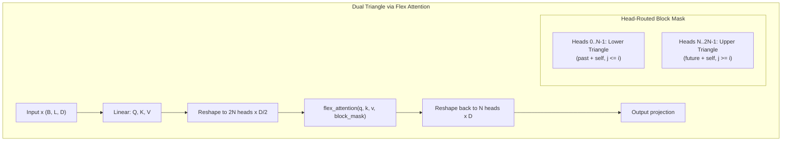

# Position Encoding Experiments: Dual Triangle Attention

This repository explores how different attention mechanisms encode positional information, with a focus on **Dual Triangle Attention** -- a novel bidirectional attention mechanism that separates query-key subspaces for forward and backward directions. We compare it against standard causal and bidirectional attention across multiple positional encoding strategies.

## Key Idea

Standard bidirectional transformers without positional embeddings are **position-invariant**: they cannot distinguish token ordering. Causal attention inherently encodes position through its triangular mask. **Dual Triangle Attention** achieves bidirectional context while maintaining positional awareness by routing different attention heads through complementary triangular masks using a single compiled `flex_attention` call.

## Architecture

All attention mechanisms use PyTorch's `torch.nn.attention.flex_attention` with compiled block masks for hardware-efficient execution.

### Dual Triangle Attention (via Flex Attention)



Each logical head is split into two sub-heads with half the dimension. The first N sub-heads attend to the lower triangle (past + diagonal), and the second N sub-heads attend to the upper triangle (future + diagonal). The diagonal is included in both triangles for numerical stability. Each sub-head gets independent softmax normalization.

### UNet Transformer (Experiment 2)

```mermaid
flowchart TD
    subgraph UNet ["UNet Transformer"]
        Input["Token Embeddings + Pos Embeddings"] --> E1["Encoder Layer 1"]
        E1 -->|skip| E2["Encoder Layer 2"]
        E2 -->|skip| EN["Encoder Layer N/2"]
        EN --> DN["Decoder Layer 1"]
        DN -->|"+ skip_weight * skip_N"| D2["Decoder Layer 2"]
        D2 -->|"+ skip_weight * skip_2"| D1["Decoder Layer N/2"]
        D1 -->|"+ skip_weight * skip_1"| LN["LayerNorm"]
        LN --> Head["LM Head"]
    end

    subgraph Block ["Each Block"]
        X0Mix["lambda_0 * x + lambda_1 * x0"] --> Attn["flex_attention"]
        Attn --> MLP["SwiGLU MLP"]
    end
```



Features:
- **Skip connections**: encoder layers save activations, decoder layers add them back with learnable `skip_weights`
- **x0 mixing**: original input residual mixed into each layer via learnable lambdas
- **Value embeddings**: per-layer embeddings from raw input tokens (mirrored for decoder)

### Joint Muon + Adam Optimizer (Experiment 2)

- **Muon**: Applied to 2D weight matrices (attention projections, MLP weights). Uses Newton-Schulz iteration to orthogonalize momentum updates.
- **AdamW**: Applied to embeddings, LM head, layer norms, biases, and scalar parameters.

## Experiments

### Experiment 1: Argmax Position Probe

Tests whether attention types can learn positional information. The task is to predict which position contains the maximum token ID in a random sequence. We sweep over combinations of hidden size, number of layers, and positional encoding strategies.

**Positional modes**: None, Learned Absolute, DroPE (drop positions mid-training), RoPE, RoPE-off

**Key finding**: Dual Triangle Attention can model positional information bidirectionally without explicit positional embeddings.

### Experiment 2a: MLM on Natural Language (FineWeb-Edu)

Trains UNet transformer models from scratch on natural language data with masked language modeling. Compares attention types and positional strategies on training-length sequences (128 tokens) and extended-length sequences (512 tokens).

### Experiment 2b: MLM on Protein Sequences (omg_prot50)

Same architecture and sweep as Experiment 2a but on protein sequences. Completely independent training from scratch (no NLP pre-training).

## Project Structure

```
position_encoding_exp/
  experiment_argmax.py            # Entry: argmax position probe (Experiment 1)
  experiment_mlm_nlp.py           # Entry: MLM on FineWeb-Edu (Experiment 2a)
  experiment_mlm_protein.py       # Entry: MLM on omg_prot50 (Experiment 2b)
  Dockerfile                      # GPU-ready Docker image
  .dockerignore
  README.md
  requirements.txt
  figures/
  SpeedrunningPLMs/               # Reference submodule
  src/
    __init__.py
    entrypoint_setup.py           # Environment setup (TF32, cuDNN, etc.)
    data/
      argmax.py                   # Argmax position task data generation
      mlm.py                      # MLM data loading, GPU-side masking, async pipeline
    models/
      attention.py                # Flex attention: causal, bidirectional, dual triangle
      components.py               # RoPE, SwiGLU MLP, Linear (bias=False)
      transformer.py              # PositionProbeTransformer, TransformerLM, TransformerLMUNet
    training/
      train_argmax.py             # Training loop for Experiment 1
      train_mlm.py                # Training loop for Experiment 2 (GradScaler, grad clip)
      optimizer.py                # Muon optimizer + build_optimizer() helper
      sweep_argmax.py             # Sweep runner for Experiment 1
      sweep_mlm.py                # Sweep runner for Experiment 2
      bugfix_checks.py            # Quick sanity checks
    plotting/
      plot_argmax.py              # Experiment 1 result plots
      plot_mlm.py                 # Experiment 2 result plots
      plot_attention.py           # Attention pattern visualizations
    utils/
      seed.py                     # Global seed setting
```

## Quickstart

### Install dependencies

```bash
pip install -r requirements.txt
```

### Run experiments (local)

**Experiment 1 (argmax probe):**
```bash
py experiment_argmax.py --bugfix      # Quick sanity check
py experiment_argmax.py               # Full sweep
```

**Experiment 2a (MLM on NLP):**
```bash
py experiment_mlm_nlp.py --bugfix     # Quick sanity check
py experiment_mlm_nlp.py              # Full sweep
```

**Experiment 2b (MLM on proteins):**
```bash
py experiment_mlm_protein.py --bugfix # Quick sanity check
py experiment_mlm_protein.py          # Full sweep
```

### Run individual sweeps directly

```bash
py -m src.training.sweep_argmax --device cuda --amp --progress
py -m src.training.sweep_mlm --dataset nl --device cuda --amp --progress
py -m src.training.sweep_mlm --dataset protein --device cuda --amp --progress
```

### Generate attention visualizations

```bash
py -m src.plotting.plot_attention
```

## Docker

The Dockerfile builds a CUDA 12.8 + Python 3.12 image with all dependencies pre-installed. The working directory is bind-mounted from the host so outputs, caches, and figures persist across runs.

### Build the image

```bash
docker build -t pos_encoding_exp .
```

### Bugfix checks (quick sanity test)

```bash
# Experiment 1
docker run --gpus all -v ${PWD}:/workspace pos_encoding_exp \
    python experiment_argmax.py --bugfix

# Experiment 2a (NLP)
docker run --gpus all -v ${PWD}:/workspace pos_encoding_exp \
    python experiment_mlm_nlp.py --bugfix

# Experiment 2b (Protein)
docker run --gpus all -v ${PWD}:/workspace pos_encoding_exp \
    python experiment_mlm_protein.py --bugfix
```

### Full experiment sweeps

For MLM experiments, increase shared memory (`--shm-size`) since the multi-worker DataLoader uses shared memory for IPC:

```bash
# Experiment 1 - argmax probe
docker run --gpus all -v ${PWD}:/workspace pos_encoding_exp \
    python experiment_argmax.py

# Experiment 2a - MLM on FineWeb-Edu
docker run --gpus all --shm-size=64g -v ${PWD}:/workspace pos_encoding_exp \
    python experiment_mlm_nlp.py

# Experiment 2b - MLM on omg_prot50
docker run --gpus all --shm-size=64g -v ${PWD}:/workspace pos_encoding_exp \
    python experiment_mlm_protein.py
```

### Run individual sweeps with custom args

```bash
docker run --gpus all --shm-size=64g -v ${PWD}:/workspace pos_encoding_exp \
    python -m src.training.sweep_mlm \
    --dataset nl --device cuda --amp --progress \
    --hidden_size 768 --n_layers 12 --batch_size 128

docker run --gpus all -v ${PWD}:/workspace pos_encoding_exp \
    python -m src.training.sweep_argmax \
    --device cuda --amp --progress \
    --d_models 64 256 --n_layers 2 4
```

### Interactive shell

```bash
docker run --gpus all -it --shm-size=64g -v ${PWD}:/workspace pos_encoding_exp bash
```

### Compile results only (skip training)

```bash
docker run --gpus all -v ${PWD}:/workspace pos_encoding_exp \
    python experiment_argmax.py --skip_runs

docker run --gpus all -v ${PWD}:/workspace pos_encoding_exp \
    python experiment_mlm_nlp.py --skip_runs
```

### Windows (PowerShell)

On Windows, replace `${PWD}` with `${pwd}` or the full path:

```powershell
docker run --gpus all -v ${pwd}:/workspace pos_encoding_exp `
    python experiment_argmax.py --bugfix
```

## Technical Details

### Flex Attention

All attention mechanisms use `torch.nn.attention.flex_attention` with `create_block_mask()` for hardware-efficient block-sparse masking:

- **Causal**: `q_idx >= kv_idx` (standard autoregressive mask)
- **Bidirectional**: `True` (full attention, no masking)
- **Dual Triangle**: Head-routed mask where heads `0..N-1` attend lower triangle and heads `N..2N-1` attend upper triangle

Block masks are compiled and cached per sequence length. For MLM training with padding, padding masks are composed with attention type masks.

### Throughput Optimizations

- Compiled `flex_attention` via `torch.compile`
- `torch.amp.GradScaler` for proper mixed-precision training
- Multi-worker DataLoader with `pin_memory=True` and `persistent_workers=True`
- GPU-side MLM masking to reduce CPU-GPU synchronization
- TF32 tensor cores enabled for float32 matmul on Ampere+ GPUs
- Gradient clipping for training stability
